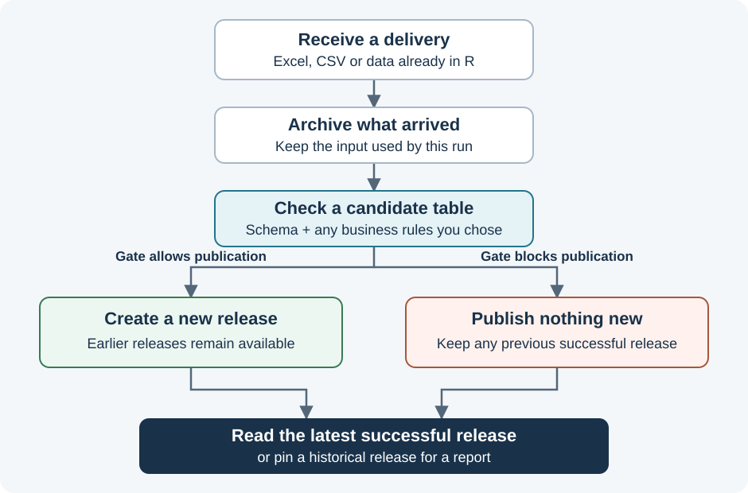

# Why lakefold? From monthly files to reliable reports

## Start with the reporting problem

Every month, teams send you spreadsheets containing their numbers. You read
those files in R, clean them, combine them and calculate a report. Then a team
sends a correction. Another file contains a duplicate row. Someone asks:
**"Which numbers did we use in the report we sent last week?"**

Reading Excel is the easy part. The recurring work is deciding which delivery
is usable, preserving earlier versions, applying the same checks each month,
and tracing a reported number back to its inputs and calculation.

**lakefold gives that recurring work a home in R.** You write incoming data to
a named dataset, read a checked version back, and keep the history needed to
explain corrections. Start with a local folder. Add business rules, reusable
calculations and shared infrastructure when the work calls for them.

The examples use two fictional entities, North and South. Their August reserve
amounts are EUR 100 and EUR 250. The reported total is EUR 350. South later
corrects its amount to EUR 270, making the current total EUR 370. Both answers
can be valid: **350 is what the original report used; 370 is the corrected view.**
The important question is which data version each answer refers to.

## What you gain

| Recurring question | What lakefold records or does | Practical benefit |
|---|---|---|
| Which delivery did we receive? | An archived original file, or an RDS snapshot when you submit an R data frame | You can inspect the input that was actually processed |
| Is this delivery usable? | Schema checks and any business rules you choose | A failed publication gate leaves the previous successful data available |
| What changed after a correction? | A new release alongside the old one | Current analysis can use the correction while an earlier report stays reproducible |
| Which table should my report read? | A stable asset name such as `"reserves"` | Report code can read the dataset without selecting filenames each month |
| Why does this report show that value? | Input release IDs, versioned metric definitions and a report manifest | You can trace the calculation and the data used |
| What needs attention? | Run status, quality results, release history and optional monitoring | You can investigate failures and missing deliveries from recorded evidence |

No time-saving percentage is assumed here. The benefit is avoiding repeated
ad hoc work around deliveries, corrections, checks and report provenance.

## Follow one delivery through the system

A **candidate** is a proposed new table. A **release** is a table version that
passed its configured publication checks. Creating the release is called
**publishing**. It means making that version available through lakefold's read
functions, not putting business data on the public internet.

If a delivery fails, its attempted publication is recorded and the previous
successful release stays available. If there has never been a successful
release, there is nothing to read yet. A file-parsing failure during the simple
API's initial schema preparation can happen before a run is created; the
archived file is still retained.

Checks have a defined scope. The automatic checks protect column names, types
and nonempty tables. A duplicate business record can have perfectly valid
column types. To catch that, you add a key or another business rule in a contract.

## Six terms, using the same example

| Term | Plain meaning | Example |
|---|---|---|
| Asset | The stable name your R code reads | `"reserves"` |
| Contract | The requirements a candidate must meet | One row per entity and reporting date, with numeric amounts |
| Pipeline | A reusable sequence for processing a delivery | Archive, read, optionally transform, check and publish |
| Release | One successfully published data state | August before or after South's correction |
| Product | A derived table with recorded input versions | A monthly totals table calculated from reserves |
| Metric | A reusable calculation with explicit meaning | Total reserve in EUR at one selected reporting date |

A **report manifest** ties metric values to their definitions and input
releases. It is a reproducibility record. Rendering Word, PowerPoint, HTML or
PDF is a later task for your reporting tools.

## The layers are places with different jobs

You can use the first three calls without configuring or memorizing layers.
When you inspect a larger workflow, these names explain where things belong.

| Place | What it holds | Question it answers |
|---|---|---|
| Landing | Archived original files or submitted R data snapshots | What exactly arrived? |
| Raw | Data extracted into a table, before optional transformations | What did the reader extract? |
| Validated | Published tables checked against their contracts | Which source data may my analysis use? |
| Products | Checked tables derived from other releases | Which prepared datasets can several reports reuse? |
| Registry | Run, definition, quality, release and lineage records | How did this result come about? |

Landing is an archive directory, not another database schema. A failed
candidate can exist physically in storage, but `dl_read()` resolves published
releases. An optional input contract can block a delivery before Raw is written;
the final candidate check still controls publication.

## Build up only as far as your use case needs

| Stage | Add this when... | Result |
|---|---|---|
| 1. Store and read | You want a repeatable place for one incoming dataset | `dl_open()`, `dl_write()`, `dl_read()` |
| 2. Keep corrections explainable | New files replace earlier information | Read current data or pin a release ID |
| 3. Add business checks | Column types alone cannot detect the mistakes that matter | A contract, with optional R or pointblank rules |
| 4. Keep several months in one current table | Each delivery contains one complete month | A pipeline with replacement by reporting date |
| 5. Reuse prepared tables | Several reports need the same joins or aggregates | A product with recorded input releases |
| 6. Reproduce reported values | You need the formula, date and input version behind a number | Metrics and report manifests |
| 7. Operate it regularly | Other people depend on the dataset arriving on time | Your scheduler, optional monitoring and a read-only catalog |

Stages 4 to 7 are optional. A useful solution can stop at storing and reading a
single dataset. The [worked walkthrough](GETTING_STARTED.md) shows every
stage using the same small example and explains the result after each step.

## Where the other tools fit

lakefold combines a workflow and its evidence. Existing tools still do their
specialized work:

| Component | Its role | When you need it |
|---|---|---|
| DuckDB | Reads, stores and queries local tables | Used by the basic local path |
| DuckLake | Manages lake tables backed by Parquet files and a catalog | Choose it when creating a lake that needs this storage layout |
| Local catalog or PostgreSQL | Records the DuckLake catalog metadata | A local catalog is enough to start; PostgreSQL is an infrastructure choice |
| Local files or S3 | Store data files and archived deliveries | Use local storage first, or configure your existing S3 service |
| dplyr / dbplyr | Express transformations in R and run supported work in the database | Use familiar data operations as needed |
| pointblank | Defines detailed checks, tolerances and segments | Add it when a key or a small R rule is insufficient |
| dbt | Builds and tests a graph of SQL models | Add it for a SQL model workflow; a dbt build and a lakefold release are separate operations |
| dm | Represents declared relationships between tables | Add it when working with primary and foreign keys across datasets |
| Posit Workbench / Connect | Provide development, scheduling and delivery environments | Reuse them if available; the package also runs in ordinary R |

The default `dl_open()` path uses local DuckDB. `dl_open("another-lake",
backend = "ducklake")` creates a separate DuckLake folder; it does not convert
or move an existing DuckDB lake. Custom layers, S3 and PostgreSQL use explicit
configuration. The [operations guide](https://github.com/JanWein/lakefold/blob/main/docs/OPERATIONS.md)
covers those choices after the local workflow is understood.

Run registry writes through one coordinated writer. Access permissions,
scheduling, backups and restoration belong to the operating environment.
Current publication can materialize a complete candidate, so assess larger
workloads in your target environment. The [validation record](https://github.com/JanWein/lakefold/blob/main/docs/VALIDATION.md)
separates tested local behavior from infrastructure that still needs verification.

## Your next step

Open [Build a monthly reporting workflow, step by step](GETTING_STARTED.md).
You will first store EUR 350, then record a correction to EUR 370, reject a
duplicate delivery, add September and reproduce the original August report.
Everything in the core walkthrough runs on synthetic data in a local R session.
