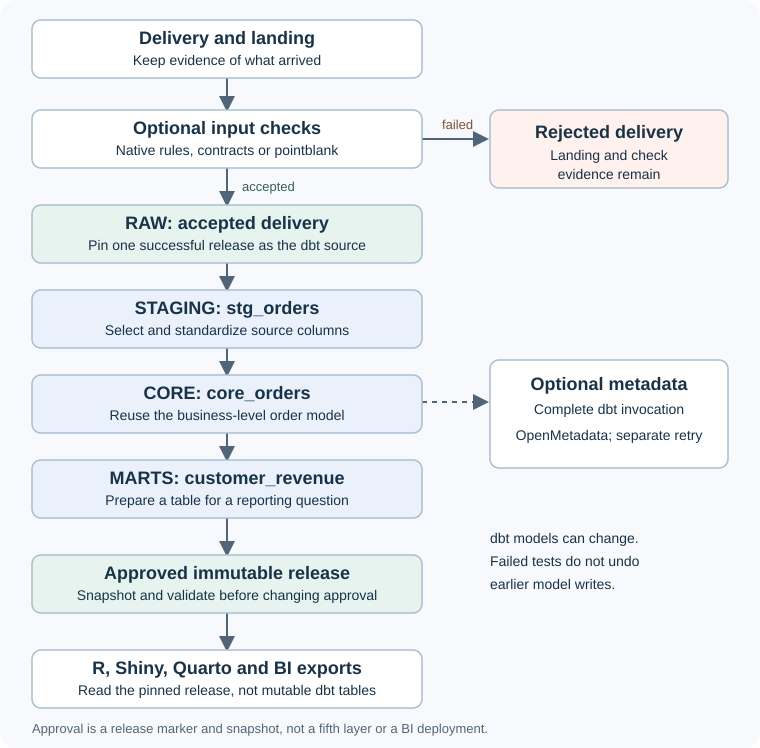

An advanced walkthrough for separately checked receipts and SQL models.
Start with [Get started](get-started.html), then [Use dbt](dbt-workflows.html).
The full example adds DuckDB, pointblank and a dbt CLI; individual examples
state which optional dependencies they need.

```{r setup, include=FALSE}
knitr::opts_chunk$set(collapse = TRUE, comment = "#>")
library(tidyweave)
root <- tempfile("tidyweave-layered-guide-")
```

## Why add layers?

Suppose you receive orders every month. Several reports need the same cleaned
orders, but each calculates a different result. Copying the cleaning code into
each report makes corrections difficult: the reports can disagree even though
they started from the same file.

A layered workflow gives each step a clear job. Keep the delivery, check whether
it is acceptable, prepare reusable tables, then publish a specific result for
consumers. When something fails, you can identify the step and keep the previous
approved result available.

You do not need this whole stack for one table. This first example runs in R
without DuckDB, dbt, pointblank or a metadata server:

```{r first-table}
orders <- data.frame(
  order_id = 1:3,
  customer_id = c(101L, 101L, 102L),
  amount = c(25, 75, 50)
)

checked <- product("orders", orders) |>
  add_quality(~ amount >= 0) |>
  run()

collect(checked)
```

The rest of this guide adds persistence and SQL models for work that needs them.
It uses the same ideas: ordinary data, optional checks and explicit outputs.

## Understand the four layers



| Place | Job | Example | What can change? |
|---|---|---|---|
| Landing | Keep evidence of what arrived, including rejected deliveries | Original CSV or an RDS snapshot | Each delivery is retained separately. Receipt does not mean acceptance. |
| `raw` | Hold accepted data in its received shape | An immutable orders release | A new delivery creates another accepted release. |
| `staging` | Standardize source-specific names and types | `stg_orders` | dbt can rebuild the model. |
| `core` | Provide reusable business-level tables | `core_orders` | dbt can rebuild the model. |
| `marts` | Answer a consumer's question | `customer_revenue` | The dbt model is mutable; its published snapshot is immutable. |

Landing is a receipt archive outside the four SQL layers. Approval is a separate
publication step within a configured layer, not an extra layer. In the small
starter, the core model names the business measure `order_amount` and derives
`is_positive_order`. Add shared business logic there when more than one mart
needs it.

## 1. Choose local storage

Install only the integrations used in this section:

```{r install-lake, eval=FALSE}
install.packages(c("duckdb", "yaml", "processx"))
```

Configure the four layers explicitly. `lake_config()` describes a lake without
opening it. Using a configuration lets ingestion and publication open and close
their own connections, which avoids leaving a local catalog locked when dbt
starts in another process.

```{r configure}
config <- lake_config(
  path = file.path(root, "lake"),
  layers = c("raw", "staging", "core", "marts"),
  backend = "duckdb"
)
```

This local DuckDB setup needs no extension download. To use DuckLake instead,
choose `backend = "ducklake"` when creating a **new** configuration. DuckLake
uses a metadata catalog and Parquet-backed storage through its DuckDB extension;
the R and dbt processes both need compatible engines and extension access.
[DuckLake introduction](https://ducklake.select/docs/stable/duckdb/introduction).

```{r configure-ducklake, eval=FALSE}
ducklake_config <- lake_config(
  registry_duckdb("ducklake-stack/metadata.ducklake"),
  storage_local("ducklake-stack/data"),
  landing = "ducklake-stack/landing",
  layers = c("raw", "staging", "core", "marts"),
  backend = "ducklake"
)
```

The starter supports local catalog and storage configurations. Use your own dbt
profile for other storage/catalog layouts. Existing lakes keep their configured
layers; the starter does not silently migrate them.

## 2. Check the delivery before RAW

```{r accept-input, eval=requireNamespace("duckdb", quietly=TRUE)}
accepted <- ingest(orders, quality = ~ amount >= 0, to = config)
collect(accepted)
accepted$outputs
```

`ingest()` infers the asset name from `orders`. With a file, it can infer the name
from its basename. Use `name = "orders"` when the input expression would be less
clear. No contract, owner or manual version is required. Without a contract, the
first accepted delivery establishes the structural schema for later deliveries.

For example, the same operation can read a file:

```{r accept-file, eval=FALSE}
accepted <- ingest("deliveries/orders.csv",
  name = "orders", quality = ~ amount >= 0, to = config)
```

CSV, TSV and RDS have native readers; Excel uses optional readxl. Supply
`reader = my_reader` for your own parsing. A file is archived before parsing and
checking it. An R table, function result or non-file source is archived as an RDS
snapshot of the received values, rather than its original transport response.
Ingestion reads and checks an in-memory table: lazy database and other non-file
sources are collected before this gate. Size the R process accordingly. This is
not a streaming or pushdown ingestion path.

Make business requirements explicit when they matter:

```{r optional-input-contract}
order_contract <- contract(
  columns = c(order_id = "integer", customer_id = "integer", amount = "numeric"),
  key = "order_id"
)
```

Pass this as `contract = order_contract` to `ingest()`. It adds the declared schema
and key checks before RAW persistence. Do not rely on inferred structure to
discover a business key or a freshness deadline.

The same simple predicate can use the optional Pointblank engine:

```{r pointblank-input, eval=FALSE}
accepted <- product("orders", orders) |>
  add_contract(order_contract) |>
  add_quality(~ amount >= 0, engine = "pointblank") |>
  ingest(to = config)
```

Omit `engine` for native checks. Both run at the same input boundary; missing
predicate results fail. For richer Pointblank step types or action policies, pass
`pointblank_checks()` to `add_quality()`. The optional adapter extends the simple
grammar without forcing every workflow to build an agent.

## 3. Inspect a rejected delivery

```{r rejected-input, eval=requireNamespace("duckdb", quietly=TRUE)}
bad_orders <- orders
bad_orders$amount[1] <- -25
rejected <- ingest(bad_orders, name = "orders",
  quality = ~ amount >= 0, stop_on_failure = FALSE, to = config)

rejected$status
quality(rejected)
collect(accepted)
```

The negative amount is not silently removed. The delivery and its failed checks
remain available as evidence, but it gets no accepted RAW release. `accepted`
still points at the earlier good data. With the default `stop_on_failure = TRUE`,
the error stops the calling workflow and retains the result for inspection.

This is why dbt receives a successful result reference, rather than an unchecked
file name or whichever staging table happened to be written last.

## 4. Give dbt a stable logical source

Install the dbt CLI and dbt-duckdb in a separate Python environment. The
[dbt guide](dbt-workflows.html) explains installation and version compatibility.
Project creation writes files; it does not install Python packages or run dbt.

```{r create-dbt-project, eval=requireNamespace("duckdb", quietly=TRUE) && requireNamespace("yaml", quietly=TRUE)}
project <- dbt_init(
  file.path(root, "analytics"), config,
  sources = list(orders = accepted)
)
```

`orders` is the logical source name inside the `raw` source group. The generated
YAML identifies the exact accepted RAW relation and records its asset, run and
release. The model uses ordinary dbt SQL:

```sql
select cast(order_id as integer) as order_id,
       cast(customer_id as integer) as customer_id,
       cast(amount as double) as amount
from {{ source('raw', 'orders') }}
```

The generated models connect that source to `stg_orders`, then `core_orders`, then
`customer_revenue`. You can inspect and edit these normal SQL and YAML files.
No seed replaces your accepted input when `sources` is supplied.

On a later delivery, select the new accepted release explicitly:

```{r rebind-source, eval=FALSE}
new_raw <- ingest(next_orders, name = "orders",
  quality = ~ amount >= 0, to = config)
project <- dbt_sources(project, list(orders = new_raw), name = "raw")
```

For the starter, keep its explicit `raw` group; managed existing projects default
to `inputs`. Keep the returned project specification. Only the source binding changes; the SQL can keep using
`source('raw', 'orders')`. Rejected inputs cannot replace that binding. Each dbt
invocation retains artifacts describing the source version it actually used.

## 5. Build the SQL layers

The following commands require the external CLI and are not executed when this
vignette is built:

```{r build-layers, eval=FALSE}
built <- project |> run(echo = FALSE)
dbt_status(built)
dbt_lineage(built)
```

dbt owns model dependencies, SQL materialization, incremental logic and tests.
The starter includes key/null checks on its models. Its **data tests run after
the relevant model is materialized**. A failed upstream test can prevent dependent
models from running; it does not undo models already written.
[dbt build semantics](https://docs.getdbt.com/reference/commands/build).

Therefore, do not let consumers treat a mutable mart as an approved release.
This guide's approval step comes next.

An optional `dbt_contract()` converts supported schema expectations into normal
dbt model properties:

```{r export-contract}
properties <- dbt_contract(order_contract, "stg_orders")
properties$models[[1]]$columns
```

Merge these properties into the model's YAML definition rather than defining the
same model in two property files. SQL types, required fields and supported unique
keys can be exported. Arbitrary R functions, pointblank checks and composite-key
rules need their original engine or explicit dbt tests. Unsupported rules raise
an error by default; `unsupported = "report"` makes the omissions visible instead.
R freshness and empty-data policies still require R validation.

## 6. Publish an approved snapshot

```{r approve-mart, eval=FALSE}
approved <- publish(built, "customer_revenue", to = config)
revenue <- collect(approved)
revenue
approved$outputs
```

With the example orders, the result has customer 101 with revenue 100 and customer
102 with revenue 50. The short model name must identify one model; supply its full
dbt unique ID if it is ambiguous.

Publication requires a successful build of the selected materialized model. It
copies the relation visible at publication time, validates the candidate and then
makes the immutable release current. Asset and definition versions have defaults.
An omitted contract checks inferred structure while allowing missing values and
empty data; it does not invent business requirements.

For an explicit consumer policy, provide a contract:

```{r approve-contract, eval=FALSE}
revenue_contract <- contract(
  columns = c(customer_id = "integer", revenue = "numeric"),
  key = "customer_id",
  rules = list(quality_rule("non_negative_revenue", ~ revenue >= 0))
)
approved <- publish(built, "customer_revenue", to = config,
  contract = revenue_contract)
```

The destination defaults to `marts` when configured, otherwise `products`.
Published snapshots and mutable dbt models can share the marts schema but have
different physical table names. `approved$outputs` is the exact snapshot reference.

Coordinate writers between build and publication: the build result records
provenance, but cannot prove that another process has not changed the live model.
Publication covers one relation, not an atomic release of the entire dbt graph.

## 7. Give consumers ordinary data

Shiny and Quarto do not need a tidyweave-specific reader. They can use the table
returned by `collect(approved)`.

```{r shiny-consumer, eval=FALSE}
revenue <- collect(approved)
ui <- shiny::fluidPage(shiny::tableOutput("revenue"))
server <- function(input, output, session) {
  output$revenue <- shiny::renderTable(revenue)
}
shiny::shinyApp(ui, server)
```

This app holds one approved snapshot for its lifetime. Choose refresh behavior
explicitly if the app should pick up later approvals.
[Shiny table outputs](https://shiny.posit.co/r/components/outputs/table/).

For a Quarto report, save the approved result reference and collect it while
rendering, or save the approved data as RDS when a self-contained report input is
more convenient:

```{r quarto-consumer, eval=FALSE}
saveRDS(collect(approved), "approved-revenue.rds")
# In a Quarto R code cell:
knitr::kable(readRDS("approved-revenue.rds"))
```

The RDS contains the selected data, so later dbt builds cannot alter that report
input. Quarto can render static dashboards or use Shiny for server-backed
interactivity; deploying either remains a separate task.
[Quarto dashboards](https://quarto.org/docs/dashboards/).

For Power BI, export the approved data to a supported file location or a database
that Power BI already knows how to query. A Parquet export is a small local example:

```{r parquet-consumer, eval=FALSE}
exported <- product("revenue_export", approved) |>
  set_target(target_parquet("approved-revenue.parquet")) |>
  run()
```

Power Query's Parquet connector supports the local filesystem, Azure Blob
Storage and Azure Data Lake Storage Gen2. Configure credentials, supported host
locations and refresh separately; exporting a file does not deploy a semantic
model or dashboard.
[Microsoft Parquet connector](https://learn.microsoft.com/en-us/power-query/connectors/parquet).

Use `target_database(connection, "customer_revenue")` instead to write an approved
table through an existing DBI connection or factory. Power BI uses the database's
supported connector or ODBC driver, not DBI itself. Choose access controls and
refresh policy in that platform.
[Microsoft ODBC connector](https://learn.microsoft.com/en-us/power-query/connectors/odbc).

A database export may be replaced on the next successful export; Parquet also
has its adapter's file-write guarantees. Keep the original release reference when
you need to prove which immutable snapshot a consumer received.

The successful result preserves pinned release lineage in the export's execution
metadata. Configuration-owned lake results open and close a read connection and return
an in-memory table. A caller-owned live lake supports lazy access while it stays
open. These ownership differences remain visible through adapter inspection. A simpler `add_source(collect(approved))` also works when only
the ordinary data is needed, but does not infer that release lineage.

## 8. Send metadata only when you need a catalog

The local lake records input releases, checks and publication evidence. A dbt
invocation also produces a manifest and run results. You do not have to type model
lineage into another R object.

If your team operates OpenMetadata, `catalog_openmetadata_dbt()` can hand these
artifacts to OpenMetadata's **official Python ingestion engine**. This is separate
from `catalog_openmetadata()`, which publishes ordinary product table metadata
over HTTP.

The external setup requires an existing OpenMetadata server, database service
and table inventory. Install `openmetadata-ingestion[dbt]` in a separate Python
environment using a version compatible with that server; the adapter supports
version 2.0.0.0 or later and Python 3.10 or later. Configure the JWT environment
variable in your deployment's secret settings.
[OpenMetadata dbt workflow](https://docs.open-metadata.org/v2.0.x/connectors/database/dbt/run-dbt-workflow-externally).

```{r optional-catalog, eval=FALSE}
catalog <- catalog_openmetadata_dbt(
  endpoint = "https://metadata.example.org",
  service = "analytics",
  token_env = "OPENMETADATA_JWT_TOKEN",
  executable = "/path/to/metadata"
)

built <- project |> run(catalog = catalog, echo = FALSE)
built$success
built$catalog_delivery
```

This runs the installed `metadata ingest` command after the dbt invocation; it
does not merely generate configuration. OpenMetadata interprets the model
descriptions, tests and SQL lineage. The service's table identities must match
the database, schema and table names in the artifacts. Source binding metadata
also identifies the selected tidyweave RAW asset, run and release.

Refresh OpenMetadata's database inventory when ingestion or dbt creates new
physical tables. In particular, a new immutable RAW release has a new physical
identifier. The dbt ingestion engine enriches existing entities; it does not
create that database inventory. If the tables are new, build without `catalog`,
run your existing database-ingestion process, then call
`publish_metadata(catalog, built)`. The automatic hook is appropriate when the
required table entities are already available.

Metadata delivery and data success answer different questions:

| Field | Meaning |
|---|---|
| `built$success` | Whether the dbt invocation succeeded. |
| `built$catalog_delivery$status` | `delivered` when the ingestion CLI exits successfully, `pending` for a retryable delivery problem, or `blocked` for invalid/changed artifacts. |
| `approved$release_id` | Which immutable consumer snapshot was published. |

Failed dbt tests can still produce useful catalog metadata. A catalog delivery
failure does not turn a successful dbt build into a failed build or undo a
publication. Restore connectivity or update the configured credentials, then
retry using the original unchanged artifacts:

```{r retry-catalog, eval=FALSE}
delivery <- publish_metadata(catalog, built)
delivery$status
```

The adapter resolves credentials at delivery time and records a credential-free
receipt beside the artifacts. Ordinary pending deliveries need no extra option
when retrying. A recorded successful delivery is reused by default.

If the earlier CLI run succeeded before all table entities existed, first refresh
the database inventory. Then deliberately resend those same artifacts:

```{r redeliver-after-inventory-refresh, eval=FALSE}
delivery <- publish_metadata(catalog, built, force = TRUE)
```

`force = TRUE` bypasses the successful-delivery receipt; it still validates the
original artifacts and does not rebuild dbt models. Use it for intentional
redelivery, rather than every normal retry. An interruption between remote
ingestion and receipt persistence can also cause a repeat; this is not an
exactly-once distributed transaction. Retain invocation artifacts and coordinate
writers to their directory.

The package does not provision the server or guarantee that every SQL dialect's
column lineage can be inferred. Check the ingestion engine's supported artifact
and server versions, then inspect the catalog to confirm the expected entities
and edges. A successful CLI exit alone does not prove lineage completeness.
Local integration tests and real remote deployment are separate verification steps.

The hook is interchangeable. `catalog = function(result) ...` receives the dbt
result, or an extension can implement `publish_metadata()` and declare
`metadata_inputs = "tw_dbt_result"` in its capabilities. A custom callback receives
the full result, including local SQL artifacts and process output, and chooses
which fields to send. Catalog callback errors remain separate from the dbt outcome.

## Run the complete example

The installed script defines a reusable function and runs a tiny native example.
Its full lake/dbt path is opt-in so sourcing it does not unexpectedly download
extensions or start an external process:

```{r runnable-example, eval=FALSE}
source(system.file("examples", "layered-data-stack.R", package = "tidyweave"))
demo <- layered_data_stack(executable = "/path/to/dbt", backend = "duckdb")
demo$revenue

# With compatible R/Python engines and the DuckLake extension available:
ducklake_demo <- layered_data_stack(executable = "/path/to/dbt",
  backend = "ducklake")
```

The example exercises an accepted delivery, a rejected delivery, a dbt build,
publication, a correction and source rebinding. Optional remote metadata is
configured separately; a runnable local stack does not imply a deployed catalog,
BI service, scheduler or distributed transaction.

```{r cleanup, include=FALSE}
unlink(root, recursive = TRUE)
```


[Back to Learn](learn.html) · [Troubleshooting](troubleshooting.html)
