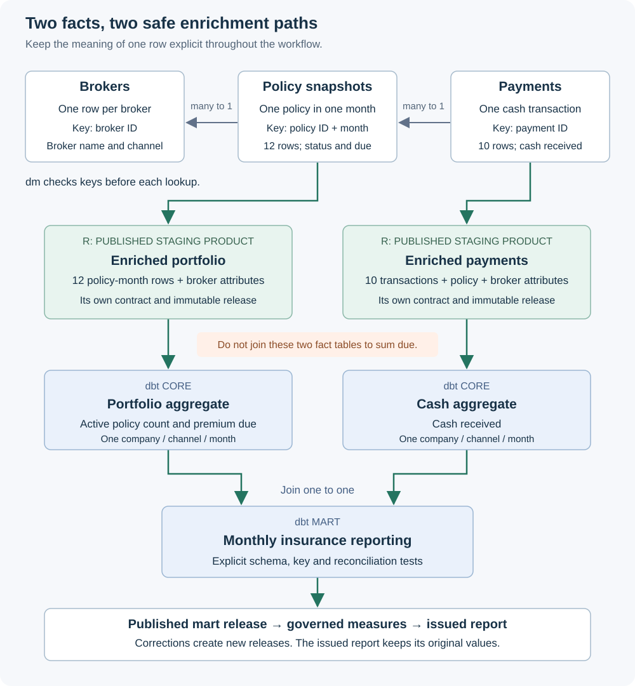

```{r setup, include=FALSE}
knitr::opts_chunk$set(collapse = TRUE, comment = "#>", message = FALSE)
library(tidyweave)
example_script <- system.file("examples", "relational-insurance.R", package = "tidyweave")
source(example_script)
example_dbt <- system.file("examples", "relational-insurance", "dbt", package = "tidyweave")
show_example_function <- function(name) {
  code <- paste(deparse(get(name, mode = "function"), width.cutoff = 88L), collapse = "\n")
  cat("```r\n", name, " <- ", code, "\n```\n", sep = "")
}
show_example_file <- function(path, language = "sql") {
  cat("```", language, "\n", paste(readLines(path, warn = FALSE), collapse = "\n"),
    "\n```\n", sep = "")
}
```

## Run the complete example

This guide turns three small insurance deliveries into two reusable relational
data products, a monthly dbt mart and a report that remains reproducible after a
correction. The enrichment uses **dm to validate relationships and perform the
joins**. It is a working example, not a diagram of an unimplemented integration.

After installing the prerequisites in section 2, run the complete example:

```{r complete-example, eval=FALSE, purl=FALSE}
library(tidyweave)
source(system.file("examples", "relational-insurance.R", package = "tidyweave"))
example <- run_relational_insurance(executable = Sys.getenv("TIDYWEAVE_DBT_EXECUTABLE", "dbt"))
```

The script defines ordinary example functions; it adds no package API. The
sections below run those same stages separately and show the important code,
tables and decisions. Start here if the complete stack still feels abstract.

All companies, brokers, policies and payments are fictional. Amounts use EUR
only. This is an engineering tutorial, not a definition of regulatory insurance
reporting or an accounting policy.

## 1. Start with the question and the meaning of one row

For January and February 2026, the business wants to know:

* How many policies were active at each month end?
* How much premium was due for each month?
* How much cash was received in each month?
* How does received cash compare with premium due, overall and by channel?

These questions require **two different facts**. A policy snapshot describes a
policy at a date. A payment describes a transaction. There can be several
payments for one policy in one month, and there can be a policy with no payment.

The `month` column is a **period label using the month's first day**:
`2026-01-01` labels January and `2026-02-01` labels February. A policy row
represents that month's end-state, not its state on the first day. Consequently,
`measure(..., at = as.Date("2026-01-01"))` selects the January snapshot. A
payment also has its actual `payment_date`, which must fall in the labelled
receipt month. This convention is part of the example's data definition.

| Table | What one row means | Key | Safe lookup |
|---|---|---|---|
| Brokers | One broker and its fixed descriptive attributes | Broker ID | None |
| Policy-month snapshots | One policy at one monthly reporting date | Policy ID and month | One broker |
| Payments | One cash transaction | Payment ID | One policy-month snapshot, then one broker |
| Enriched portfolio | The same policy-month row, with descriptive attributes | Policy ID and month | Already resolved |
| Enriched payments | The same payment row, with policy and broker attributes | Payment ID | Already resolved |
| Monthly mart | One company, channel and month | Company, channel and month | Already aggregated |



Suppose a policy has EUR 100 due and two payments of EUR 40 and EUR 60. Joining
the policy directly to its payments produces two rows containing EUR 100 due.
Summing that joined column reports EUR 200 due. Valid foreign keys do not make
that calculation correct. We therefore enrich each fact independently and join
them only after both have the same unique monthly grain.

## 2. Choose the tools, without confusing their responsibilities

The full example needs these optional R packages:

```{r install-integrations, eval=FALSE, purl=FALSE}
install.packages(c("duckdb", "dm", "pointblank", "yaml", "processx"))
```

It also needs a separately installed dbt CLI with dbt-duckdb. Use the installation
and engine compatibility instructions in the [dbt guide](dbt-workflows.html).
If the executable is not on your `PATH`, set its path explicitly:

```{r configure-cli, eval=FALSE, purl=FALSE}
Sys.setenv(TIDYWEAVE_DBT_EXECUTABLE = "/path/to/dbt-environment/bin/dbt")
```

The full runner defaults to a local **DuckLake**. Both R and dbt need compatible
DuckDB engines and access to the DuckLake extension. For a local test without
that extension, pass `backend = "duckdb"` to the runner or setup function. The
storage choice does not change the relationship model or reporting calculations.

| Tool | Responsibility in this example | What it does not establish |
|---|---|---|
| R contracts | Declare each input or product's schema, required fields and key | A schema alone does not establish business meaning |
| Pointblank | Check the contents of each received table before RAW acceptance | Independent table checks do not establish cross-table references |
| dm | Validate primary and foreign keys, then follow many-to-one enrichment paths | Correct relationships do not choose an aggregation grain for you |
| dbt | Build the reporting SQL graph and run its declared data tests | A successful build is not an immutable tidyweave publication |
| tidyweave publication | Validate and keep a specific product release | Publication is not deployment to a BI service |
| Metrics and reports | Apply agreed calculations to pinned releases and preserve issued values | An `approved` flag is not a separate authorization system |

Normal package builds do not execute the full lake/dbt workflow. To render every
stage in this vignette, configure the CLI and set
`TIDYWEAVE_RUN_INSURANCE_VIGNETTE=true`. In-memory data and relationship previews
run when their R dependencies are available. The complete runner does not need
that vignette-rendering switch.

## 3. Inspect the three deliveries before writing anything

```{r synthetic-inputs}
inputs <- insurance_inputs()
vapply(inputs, nrow, integer(1))
```

There are twelve policy-month snapshots: six policies observed in each of two
months. There are ten initial payment transactions. The two counts are supposed
to differ. The broker table provides broker names and channels. Company belongs
to the policy snapshot and reaches payments through the policy relationship.

```{r preview-brokers}
knitr::kable(inputs$brokers)
```

```{r preview-policies}
knitr::kable(inputs$policy_months)
```

```{r preview-payments}
knitr::kable(inputs$payments)
```

These are **full snapshots of the example's two-month data**, not event streams
or incremental append instructions. A corrected payment delivery will contain
all previous payment rows plus the additional transaction. Keeping that choice
explicit prevents accidental loss of an earlier month when a new release
replaces the current full table.

## 4. Distinguish data, definitions and releases

The framework does not require everything to be a custom object. The input
tables above are ordinary tibbles. Objects become useful when there is an
instruction or promise to reuse.

| Object in the walkthrough | Kind | Meaning |
|---|---|---|
| `inputs$policy_months` | Data | The received values in memory |
| `contracts$policy_months` | Specification | The input table's declared promise |
| `context$config` | Configuration | Where storage and registry live |
| `definitions$policies` | Product specification | Which pinned inputs to enrich, check and publish |
| `published$policies` | Run result | What happened, including the published release ID |
| `source_release(...)` | Source specification | How to read one selected immutable release |
| `metrics$cash_collected` | Metric specification | The approved calculation and permitted dimensions |
| A `measure()` result | Values plus a manifest | A calculation tied to its data and code identity |
| An issued report | Stored result | The saved measurements and their explanation |

Defining a product does not execute it. Running a product with a lake target
creates a checked release. Reading an issued report does not rerun the product,
dbt or the metric.

## 5. Define a contract at each meaningful boundary

```{r define-contracts}
contracts <- insurance_contracts()
contracts$policy_months
contracts$enriched_policy_months
contracts$enriched_payments
contracts$mart
```

The input and enriched product contracts are deliberately separate. Adding
broker attributes or policy attributes changes the table's promise. A downstream user
should not have to know that an upstream broker table exists to understand the
enriched portfolio's columns and key.

The monthly mart needs another contract because aggregation changes both the
columns and the grain. A contract for one payment is not a contract for one
company, channel and month.

The example definitions are ordinary `contract()` calls. For instance, this is
the complete input promise for a payment:

```{r representative-payment-contract}
contract("insurance.payments.schema",
  columns = c(payment_id = "character", policy_id = "character", month = "Date",
    payment_date = "Date", cash_amount = "numeric"),
  key = "payment_id",
  grain = "One cash transaction, assigned to its receipt month.")
```

<details>
<summary>Inspect the complete input, product and mart contract definitions</summary>

```{r show-contract-definitions, echo=FALSE, results='asis'}
show_example_function("insurance_contracts")
```

</details>

`required` declares non-null columns. Key columns must be non-null and their
combination must uniquely identify a row. Contracts do not silently coerce a
payment into the right type, invent missing broker IDs or remove duplicate rows.

## 6. Configure the four layers and the receipt archive

```{r configure-insurance, eval=identical(Sys.getenv("TIDYWEAVE_RUN_INSURANCE_VIGNETTE"), "true")}
context <- insurance_setup(backend = "ducklake")
context$config
```

The setup helper creates a fresh local example location. Its configuration uses
`raw`, `staging`, `core` and `marts`, with a separate landing archive. This example
has its own bundled dbt project, introduced below.

<details>
<summary>Inspect the local storage configuration helper</summary>

```{r show-setup, echo=FALSE, results='asis'}
show_example_function("insurance_setup")
```

</details>

| Location | This example's contents | Publication meaning |
|---|---|---|
| Landing | Received values and evidence, including rejected deliveries | Receipt alone is not acceptance |
| RAW | Accepted brokers, policy-month snapshots and payments | Each accepted delivery has an immutable release |
| STAGING | Two reusable R products enriched with dm | Each has its own contract and published release |
| CORE | dbt portfolio and cash aggregates | Working SQL models can be rebuilt |
| MARTS | dbt reporting model and its separately published snapshot | Consumers pin the approved snapshot |

**A layer name describes a table's role, not its approval state.** A staging
product can be published, governed and useful to several consumers. A mutable
dbt table in `marts` is not automatically an approved release. The physical layer
and the publication lifecycle answer different questions.

## 7. Accept each input with Pointblank checks before RAW

```{r accept-insurance-inputs, eval=identical(Sys.getenv("TIDYWEAVE_RUN_INSURANCE_VIGNETTE"), "true")}
raw <- insurance_ingest(context)
vapply(raw, function(result) result$status, character(1))
vapply(raw, function(result) result$release_id, character(1))
quality(raw$payments)
```

The helper is a short sequence of `ingest()` calls, each with an explicit input
contract and Pointblank checks. Pointblank checks the delivered values; the
contract checks the declared structure and key. A blocking failure stops that
input from obtaining an accepted RAW release.

`pointblank_checks()` wraps a function returning a
[pointblank agent](https://rstudio.github.io/pointblank/reference/create_agent.html).
The adapter runs that agent at the quality gate. The actual channel, policy
status and positive-cash checks are visible below.

```{r show-ingestion, echo=FALSE, results='asis'}
show_example_function("insurance_checks")
show_example_function("insurance_ingest")
```

An accepted result records the exact asset and release. A later publication of
the same asset does not change that result. The three accepted results are not
an atomic multi-table delivery bundle. This example deliberately passes the
three selected references together into its product definitions.

Ingestion collects these small inputs into R memory. That is appropriate for the
fixture and is an explicit capacity boundary for larger deliveries. A lazy
adapter does not make this particular acceptance path a streaming pipeline.

## 8. Pin the accepted inputs in reusable product definitions

```{r define-relational-products, eval=identical(Sys.getenv("TIDYWEAVE_RUN_INSURANCE_VIGNETTE"), "true")}
definitions <- insurance_products(context, raw)
definitions$policies
definitions$payments
```

Each source uses `source_release()` with an explicit release ID. Multiple named
sources give a transformation a named list of tables, so the transformation can
refer to `tables$brokers`, `tables$policy_months` and `tables$payments` naturally.

The complete product composition is worth reading:

```{r show-product-definitions, echo=FALSE, results='asis'}
show_example_function("insurance_products")
```

This is the same small grammar as a one-table product: `product()`,
`add_source()`, `add_transform()`, `add_contract()` and `set_target()`. The
relational work remains an ordinary R function. The target chooses the
`staging` layer without changing how the transformation describes its work.

Configuration-backed release sources are materialized for these R transforms.
Their exact release references are retained as input lineage. Connections opened
by the framework are closed when their work finishes, so the later dbt process
can open its own connection.

## 9. Validate the relational model with dm

Before flattening anything, inspect the relationships in memory:

```{r inspect-insurance-dm, eval=requireNamespace("dm", quietly = TRUE)}
relationships <- insurance_dm(inputs, check = FALSE)
relationship_checks <- dm::dm_examine_constraints(relationships)
relationship_checks
stopifnot(all(relationship_checks$is_key))
```

The actual model construction declares primary keys and foreign keys:

```{r show-relational-model, echo=FALSE, results='asis'}
show_example_function("insurance_dm")
```

The payment-to-policy relationship uses **policy ID and month together**. A
policy ID by itself matches both monthly snapshots. Using that incomplete key
would multiply payments and could attach attributes from the wrong date.

[`dm_examine_constraints()`](https://dm.cynkra.com/reference/dm_examine_constraints.html)
returns a diagnostic table. Calling it alone does not stop a workflow. The
example's `check = TRUE` path explicitly rejects failed constraints, and the
enrichment functions use that path before joining.

This gate also separates two useful failures. A duplicated parent key means a
child could match several parents. An orphan foreign key means it matches no
parent. Both need a decision before enrichment; neither should disappear in a
convenient join.

## 10. Enrich the portfolio while preserving one policy-month row

```{r show-policy-enrichment, echo=FALSE, results='asis'}
show_example_function("insurance_enrich_policies")
```

```{r preview-enriched-policies, eval=requireNamespace("dm", quietly = TRUE)}
enriched_policies <- insurance_enrich_policies(inputs)
knitr::kable(enriched_policies)
stopifnot(nrow(enriched_policies) == nrow(inputs$policy_months))
```

The flattening starts at the policy-month table and follows its foreign key to
the broker. That is a many-to-one lookup: each policy-month row receives one set
of broker attributes. It does not walk down to the policy's payment rows.

[`dm_flatten_to_tbl()`](https://dm.cynkra.com/reference/dm_flatten_to_tbl.html)
uses the declared relationships to follow outgoing foreign keys. The explicit
starting table is important because it determines the intended row grain.

The resulting twelve rows are a useful product in their own right. A portfolio
report, policy servicing analysis or another mart can reuse them without
reimplementing the broker enrichment.

## 11. Enrich payments along a different many-to-one path

```{r show-payment-enrichment, echo=FALSE, results='asis'}
show_example_function("insurance_enrich_payments")
```

```{r preview-enriched-payments, eval=requireNamespace("dm", quietly = TRUE)}
enriched_payments <- insurance_enrich_payments(inputs)
knitr::kable(enriched_payments)
stopifnot(nrow(enriched_payments) == nrow(inputs$payments))
```

This flattening starts at payments. Its first lookup identifies one policy-month
snapshot; its next lookup identifies that snapshot's broker. Recursive
flattening follows the ancestors while retaining one row per transaction.

The payment product can contain attributes from the policy snapshot, but that
does not make a copied premium-due column additive across its rows. The dbt
portfolio aggregate will therefore read the portfolio product, and the cash
aggregate will read the payment product.

The fixture matches cash to the snapshot for its payment month. It does not
allocate a late payment back to a contractual coverage period, calculate
receivables ageing or split one payment across policies. Those are separate
business rules that would require additional keys and products.

## 12. Publish two independently contracted staging products

```{r publish-relational-products, eval=identical(Sys.getenv("TIDYWEAVE_RUN_INSURANCE_VIGNETTE"), "true")}
published <- lapply(definitions, run)
vapply(published, function(result) result$release_id, character(1))
quality(published$policies)
quality(published$payments)
```

Each execution reads pinned inputs, checks relationships during transformation,
checks its own output contract, then publishes its table. The output contract is
a final check that the transformation still returned the promised grain and
columns.

These are two publications, not a distributed transaction. Downstream work
starts only after both successful results are available. If the second product
fails, the first can already have a valid release, while the previously issued
report remains unchanged.

## 13. Give dbt the exact published staging relations

```{r prepare-insurance-dbt, eval=identical(Sys.getenv("TIDYWEAVE_RUN_INSURANCE_VIGNETTE"), "true")}
project <- insurance_dbt_project(context, published,
  executable = Sys.getenv("TIDYWEAVE_DBT_EXECUTABLE", "dbt"))
project
```

The current `dbt_sources()` convenience function binds accepted **RAW** releases.
These inputs are published **STAGING** products. Their results identify the
asset and immutable release. The example looks up that exact release with the
public `releases(lake, asset)` function, resolves its schema and table, and
writes ordinary dbt source YAML. This is an explicit example helper, not an
undocumented use of `dbt_sources()`.

<details>
<summary>Inspect the exact-release lookup and ordinary source YAML writer</summary>

```{r show-staging-source-binding, echo=FALSE, results='asis'}
show_example_function("insurance_bind_products")
```

</details>

The binding records the actual database, schema and immutable table identifier,
plus the asset and release identity. It does not guess a physical table name or
point at a mutable "latest" view. The SQL refers to stable logical source names;
a later correction changes the binding explicitly.

The project is a small, ordinary bundled dbt project. It does not need the orders
starter or a dbt package installation. Its SQL, properties and tests are part of
the installed example, so the walkthrough can display the files it executes.

Its layer configuration is a normal `dbt_project.yml`:

```{r insurance-project-yaml, echo=FALSE, results='asis'}
show_example_file(file.path(example_dbt, "dbt_project.yml"), "yaml")
```

The source file produced from the selected staging releases is:

```{r insurance-generated-sources, echo=FALSE, results='asis', eval=identical(Sys.getenv("TIDYWEAVE_RUN_INSURANCE_VIGNETTE"), "true")}
show_example_file(file.path(project$path, "models", "sources.yml"), "yaml")
```

This last output is available when running the complete walkthrough. Physical
table and release identifiers vary by run; the logical `policies` and `payments`
source names stay the same.

## 14. Aggregate portfolio and cash separately in dbt CORE

The portfolio model counts active policies and sums monthly premium due from
the **policy-month product**. The cash model sums transactions from the
**payment product**. Each groups by the same company, channel and month.

`core_policy_monthly.sql`:

```{r portfolio-core-sql, echo=FALSE, results='asis'}
show_example_file(file.path(example_dbt, "models", "core", "core_policy_monthly.sql"))
```

`core_cash_monthly.sql`:

```{r cash-core-sql, echo=FALSE, results='asis'}
show_example_file(file.path(example_dbt, "models", "core", "core_cash_monthly.sql"))
```

Review the source of each measure as carefully as its formula:

| Output | Input fact | Across rows within a month | Across months |
|---|---|---|---|
| Active policies | Policy-month snapshots | Add across disjoint company/channel groups | Select one date; do not add repeated monthly observations |
| Premium due | Policy-month snapshots | Sum each policy-month's due amount once | May sum the periods when that is the agreed definition |
| Cash collected | Payment transactions | Sum each transaction once | May sum the transaction periods |

Grouping does not repair an earlier duplicated join. The safe grain is preserved
before the aggregations, and each aggregate must be unique on its grouping key.

## 15. Join unique monthly groups into the mart

Only now do the portfolio and payment paths meet. The mart joins their monthly
aggregates by company, channel and month, producing one reporting row for each
group.

`monthly_performance.sql`:

```{r insurance-mart-sql, echo=FALSE, results='asis'}
show_example_file(file.path(example_dbt, "models", "marts", "monthly_performance.sql"))
```

A missing cash aggregate for a portfolio group means no received transaction in
that group and month. It is different from a missing broker or an orphan policy
reference, which would already have failed enrichment. The model makes its
zero-cash policy explicit rather than treating every missing value alike.

The initial mart should contain these six groups. Northstar's direct channel
has a February row with zero active policies, zero premium due and no payments;
its lapsed policy snapshot still provides that reporting group.

```{r expected-mart-groups}
expected_mart <- tibble::tibble(
  company = rep(c("Harbor", "Northstar", "Northstar"), 2),
  channel = rep(c("partner", "broker", "direct"), 2),
  month = rep(as.Date(c("2026-01-01", "2026-02-01")), each = 3),
  active_policies = c(2L, 2L, 1L, 2L, 3L, 0L),
  premium_due = c(900, 300, 300, 900, 450, 0),
  payment_count = c(1L, 3L, 1L, 2L, 3L, 0L),
  cash_collected = c(400, 280, 300, 850, 450, 0)
)
knitr::kable(expected_mart)
```

The expected monthly totals are independently specified, not calculated by
summing the model's own output:

```{r expected-monthly-totals}
expected_totals <- data.frame(
  month = as.Date(c("2026-01-01", "2026-02-01")),
  active_policies = c(5L, 5L),
  premium_due = c(1500, 1350),
  cash_collected = c(980, 1300),
  cash_to_due = c(980 / 1500, 1300 / 1350)
)
knitr::kable(expected_totals, digits = 4)
```

## 16. Check dbt's output and publish an immutable mart

The project exports supported structural expectations with `dbt_contract()` and
adds ordinary dbt tests for relationships, keys and reconciliation. A composite
monthly key needs an explicit dbt test; the R-to-dbt contract exporter does not
pretend to translate that rule automatically.

The structural bridge produces ordinary YAML-ready properties. For example:

```{r export-insurance-schema}
mart_properties <- dbt_contract(contracts$mart_schema, "monthly_performance")
mart_properties$models[[1]]$columns
```

The project helper writes those properties for both core models and the mart in
`models/contracts.yml`. It deliberately exports `mart_schema`, which declares
the structural columns, rather than pretending that the full R mart contract's
composite key and business formulas have been translated. The full contract
still applies at R publication. An unsupported rule is not silently discarded.

The project's explicit uniqueness test must return **no rows**:

```{r insurance-unique-test, echo=FALSE, results='asis'}
show_example_file(file.path(example_dbt, "tests", "unique_reporting_grains.sql"))
```

Its payment relationship test rechecks the SQL inputs and receipt-month rule:

```{r insurance-relationship-test, echo=FALSE, results='asis'}
show_example_file(file.path(example_dbt, "tests", "payment_policy_relationship.sql"))
```

Finally, the reconciliation test compares mart totals with independently
aggregated source facts. It detects amounts or transactions lost or duplicated
by a model change:

```{r insurance-reconciliation-test, echo=FALSE, results='asis'}
show_example_file(file.path(example_dbt, "tests", "reconcile_monthly_totals.sql"))
```

```{r build-and-publish-insurance, eval=identical(Sys.getenv("TIDYWEAVE_RUN_INSURANCE_VIGNETTE"), "true")}
built <- dbt_build(project, echo = FALSE)
dbt_status(built)
```

```{r publish-insurance-mart, eval=identical(Sys.getenv("TIDYWEAVE_RUN_INSURANCE_VIGNETTE"), "true")}
approved <- dbt_publish(context$config, built, "monthly_performance",
  contract = context$contracts$mart,
  asset = "insurance.monthly_performance")
mart_data <- collect(approved)
knitr::kable(dplyr::arrange(mart_data, month, company, channel))
approved$release_id
stopifnot(isTRUE(all.equal(dplyr::arrange(mart_data, month, company, channel),
  expected_mart, check.attributes = FALSE)))
```

A dbt data test can fail after its model has been written. `dbt_build()` is not a
transaction covering every model. The separate `dbt_publish()` step checks the
successful invocation and snapshots its selected output under the explicit R
mart contract. Consumers use that immutable release, not the mutable dbt table.

No R connection is kept open while dbt runs. The configuration-backed R stages
and the dbt subprocess own their connections separately. This matters for a
local catalog and is not solved by putting more layers into a diagram.

## 17. Define governed stock, flow and ratio metrics

```{r define-insurance-metrics}
metrics <- insurance_metrics()
names(metrics)
```

The metric specifications make time semantics explicit:

```{r show-insurance-metrics, echo=FALSE, results='asis'}
show_example_function("insurance_metrics")
```

An **active-policy stock** needs exactly one reporting date. January and
February each contain five active policies, but reporting ten active policies
for the two-month period would count observations rather than answer the
month-end question.

**Premium due and cash received are period flows in this example.** Their
metric definitions explicitly allow several dates. The initial two-month cash
total is EUR 2,280. That says how much arrived during the period; it does not
prove that January obligations were fully settled.

The ratio follows this definition:

\[
\text{cash-to-due ratio} =
\frac{\sum \text{cash collected}}{\sum \text{premium due}}
\]

Across both months it is `2280 / 2850 = 0.8`. Averaging January's and February's
percentages would weight a smaller premium base as heavily as a larger one.
The same problem applies to averaging channel percentages. Always aggregate
the numerator and denominator at the requested scope before dividing.

When total premium due is zero, this ratio is undefined. The example does not
invent a zero percentage. Its non-finite result is rejected by `measure()`.
A different policy needs an explicit, reviewed formula and code version.

## 18. Measure the pinned mart and issue a report

```{r measure-and-issue-report, eval=identical(Sys.getenv("TIDYWEAVE_RUN_INSURANCE_VIGNETTE"), "true")}
initial <- insurance_measure(context, approved, "insurance.report.initial")
knitr::kable(initial$summary, digits = 4)
initial$measures$cash_by_channel_jan
initial$measures$cash_total
initial$measures$ratio_total
stopifnot(isTRUE(all.equal(initial$summary, expected_totals,
  check.attributes = FALSE)))
```

The helper opens a lake connection for measurement, supplies the selected mart
release to each `measure()` call, writes a report with `report_release()`, then
closes the connection. These are the actual reporting calls:

```{r show-insurance-measurement, echo=FALSE, results='asis'}
show_example_function("insurance_measure")
```

The output tables carry manifests with metric definitions, parameters, input
release identity and result hashes. The report saves both the measured values
and their explanation. Reading the report later does not recalculate them
against whichever mart happens to be current.

`approved = TRUE` records the example author's declared business approval. It
does not grant permissions, obtain another person's sign-off or replace your
organization's review process. Code versions identify the implementation used;
arbitrary function environments are not automatically versioned.

## 19. Exercise failures before trusting the workflow

First consider a negative received amount. The fixture does not model refunds,
so that amount violates the input policy:

```{r reject-negative-cash, eval=identical(Sys.getenv("TIDYWEAVE_RUN_INSURANCE_VIGNETTE"), "true")}
bad_payments <- inputs$payments
bad_payments$cash_amount[1] <- -60
rejected <- ingest(context$config, bad_payments,
  name = "insurance.payments", contract = contracts$payments,
  quality = insurance_checks()$payments, stop_on_failure = FALSE)
rejected$status
quality(rejected)
stopifnot(rejected$status == "blocked")
```

The rejected delivery remains receipt evidence. It gets no accepted RAW release
and cannot silently replace the earlier selected input. Supporting refunds
later would require a deliberate change to the input and business definitions,
not merely removing the check to make an error disappear.

Now consider a valid-looking broker identifier that does not exist in the
delivered broker table:

```{r orphan-diagnostics, eval=requireNamespace("dm", quietly = TRUE)}
orphan_inputs <- inputs
orphan_inputs$policy_months$broker_id[1] <- "B404"
orphan_dm <- insurance_dm(orphan_inputs, check = FALSE)
orphan_checks <- dm::dm_examine_constraints(orphan_dm)
orphan_checks[!orphan_checks$is_key, ]
orphan_error <- tryCatch(insurance_enrich_policies(orphan_inputs), error = identity)
stopifnot(inherits(orphan_error, "error"))
conditionMessage(orphan_error)
```

A required character column alone cannot detect that orphan. dm catches it
because it compares the key against the selected broker table. Flattening stops
before the bad relationship can become a published enriched product.

The product execution path enforces the same failure. Replace only the policy
source in a candidate definition, run it, and confirm the previous published
portfolio is still current:

```{r reject-orphan-product, eval=identical(Sys.getenv("TIDYWEAVE_RUN_INSURANCE_VIGNETTE"), "true")}
orphan_definition <- definitions$policies |>
  add_source(orphan_inputs$policy_months, name = "policy_months", replace = TRUE)
orphan_run <- run(orphan_definition, stop_on_failure = FALSE)
orphan_run$status
lake <- connect_lake(context$config, read_only = TRUE)
current_policy_id <- releases(lake, published$policies$asset)$release_id[[1L]]
close_lake(lake)
stopifnot(orphan_run$status == "error",
  identical(current_policy_id, published$policies$release_id))
```

Other useful failure checks are a duplicated policy-month key, a payment linked
to a nonexistent month and a failed dbt reconciliation. Time and ratio policies
are also executable checks. The following two calculations must fail:

```{r invalid-metric-scopes, eval=identical(Sys.getenv("TIDYWEAVE_RUN_INSURANCE_VIGNETTE"), "true")}
lake <- connect_lake(context$config, read_only = TRUE)
two_month_stock <- tryCatch(measure(lake, metrics$active_policies,
  at = as.Date(c("2026-01-01", "2026-02-01")), release = approved$release_id),
  error = identity)
undefined_ratio <- tryCatch(measure(lake, metrics$cash_to_due,
  at = as.Date("2026-02-01"), filters = list(company = "Northstar", channel = "direct"),
  release = approved$release_id), error = identity)
close_lake(lake)
stopifnot(inherits(two_month_stock, "error"), inherits(undefined_ratio, "error"))
conditionMessage(two_month_stock)
conditionMessage(undefined_ratio)
```

Each failure belongs at a specific boundary. Adding the same
check everywhere is less useful than understanding which promise it enforces.

## 20. Accept a correction without rewriting the issued report

```{r corrected-payment-preview}
corrected_inputs <- insurance_corrected_inputs(inputs)
knitr::kable(tail(corrected_inputs$payments, 1L))
```

The correction adds a January payment of EUR 250 for policy P5. It is another
full payment snapshot with eleven transactions. The policy snapshots and broker
attributes are unchanged. January cash becomes EUR 1,230; February remains
EUR 1,300. January's ratio becomes `1230 / 1500 = 0.82`.

```{r accept-corrected-payment-product, eval=identical(Sys.getenv("TIDYWEAVE_RUN_INSURANCE_VIGNETTE"), "true")}
corrected_raw <- raw
corrected_raw$payments <- insurance_ingest(context, corrected_inputs["payments"])$payments
corrected_definitions <- insurance_products(context, corrected_raw)
corrected_products <- published
corrected_products$payments <- run(corrected_definitions$payments)
insurance_bind_products(project, corrected_products)
```

Only payments need a new input and product release. The unchanged portfolio
release is reused explicitly; neither a new table name nor a new month forces
unnecessary recomputation.

```{r rebuild-corrected-mart, eval=identical(Sys.getenv("TIDYWEAVE_RUN_INSURANCE_VIGNETTE"), "true")}
rebuilt <- dbt_build(project, echo = FALSE)
corrected_release <- dbt_publish(context$config, rebuilt, "monthly_performance",
  contract = context$contracts$mart,
  asset = "insurance.monthly_performance")
corrected <- insurance_measure(context, corrected_release, "insurance.report.corrected")
knitr::kable(corrected$summary, digits = 4)
stopifnot(corrected$summary$cash_collected[1] == 1230,
  corrected$summary$cash_collected[2] == 1300,
  approved$release_id != corrected_release$release_id)
```

The source binding changes to selected new product releases. SQL model names
remain stable. The new build can update mutable dbt tables, and its successful
publication creates a different immutable mart release.

The earlier report ID still returns its original January cash of EUR 980. The
corrected report uses another ID and the new release, returning EUR 1,230.
Neither the old report nor its approved input should be overwritten to make
history look as if the correction had arrived earlier.

```{r verify-preserved-report, eval=identical(Sys.getenv("TIDYWEAVE_RUN_INSURANCE_VIGNETTE"), "true")}
lake <- connect_lake(context$config, read_only = TRUE)
old_report <- report_read(lake, "insurance.report.initial", values_only = TRUE)
new_report <- report_read(lake, "insurance.report.corrected", values_only = TRUE)
old_data <- read_release(lake, approved$asset, release = approved$release_id)
close_lake(lake)

data.frame(
  report = c("Initial issued report", "Corrected report"),
  january_cash = c(old_report$cash_jan$value, new_report$cash_jan$value)
)
stopifnot(old_report$cash_jan$value == 980,
  new_report$cash_jan$value == 1230,
  sum(old_data$cash_collected[old_data$month == as.Date("2026-01-01")]) == 980)
```

## What to reuse, and what to redesign for production

Keep the small grammar and the boundaries: checked deliveries, pinned source
releases, explicit relational grain, reusable contracted products, ordinary dbt
models and pinned reports. Replace the synthetic input function with your real
reader when the fixture's business assumptions match your use case.

Several assumptions need deliberate changes in a larger system:

* Broker attributes are static in this fixture. A historical channel change
  needs effective dates and an as-of relationship, not a join to the latest
  broker row.
* Payment month is the cash timing dimension. Allocation to a coverage period,
  refunds, cancellations, tax and multiple currencies need explicit rules.
* Ingestion and the demonstrated dm transforms use memory. Larger workloads
  need suitable lazy operations and backend tests, or database-side modeling.
* Full-table snapshots and separately published products are intentional here.
  Incremental delivery semantics and atomic multi-product releases are separate
  design decisions.
* Local lake and receipt writes require one coordinated writer. Scheduling,
  access control, credentials and deployment remain responsibilities of the
  surrounding platform.

Optional catalogs can consume metadata after these stages. In particular,
OpenMetadata's dbt ingestion engine needs its database inventory refreshed for
new physical relations. A successful metadata delivery is distinct from the
publication state and does not prove that every intended lineage edge exists.
See the [layered guide](layered-data-stack.html) for that optional integration.

```{r cleanup-insurance-guide, include=FALSE, eval=identical(Sys.getenv("TIDYWEAVE_RUN_INSURANCE_VIGNETTE"), "true")}
unlink(context$path, recursive = TRUE)
```
