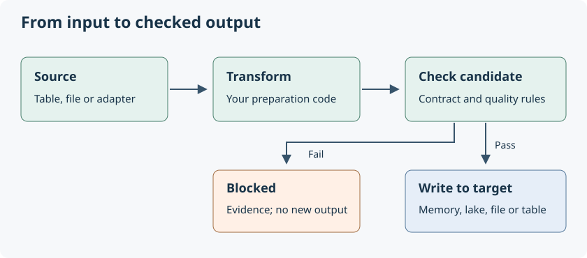

## The problem starts after the first successful script

Imagine a team sends you an orders spreadsheet every Monday. Your R script
reads it, fixes column names and produces a weekly total. That works.

Then a column disappears. A correction arrives after you sent the report.
Another report needs the same preparation. Someone asks which input produced
last week's number. You start adding checks, saving copies and writing logs
around the original calculation.

**tidyweave gives that repeated surrounding work a consistent structure.**
Keep your R functions. Put acquisition, preparation and checks into a named
product. Run that definition for the next delivery. Add storage and specialist
integrations only when they solve a problem you actually have.

## A product is a recipe for a useful table

```{r small-example}
library(tidyweave)

orders <- product("orders") |>
  add_source(data.frame(id = 1:2, amount = c(100, 250))) |>
  add_quality(~ amount >= 0)

result <- run(orders)
sum(collect(result)$amount)
stopifnot(sum(collect(result)$amount) == 350)
```

The product is the reusable definition. The result is one execution of it.
The collected output is an ordinary table. You can start with just those three
ideas; infrastructure and business ownership fields are optional.



A **contract** says what a table must look like, such as its types and unique
key. A **quality rule** checks its contents. A **target** says where to write it.
These are additions to the same product, rather than separate ways of working.

## What changes in your everyday work?

| Situation | What you do | What you gain |
|---|---|---|
| Another file arrives | Run the same product with the new source | The same preparation and checks |
| A check fails | Inspect `quality(result)` or `incidents(result)` | A named failed check and counts |
| Two reports need the same prepared data | Use the product as another product's source | One shared definition |
| Data should live outside your R session | Add a target | An explicit destination and its guarantees |
| You need an execution record | Supply `evidence = "runs"` | Durable statuses, schema and check counts |
| Your source moves to a database | Replace the source adapter | The rest of the composition can remain familiar |

A source change may still need a different transformation: a database supports
SQL translations, whereas an arbitrary R function may require collection.
Interchangeable adapters expose these boundaries; they do not remove them.

## Why keep releases?

Suppose August's report used a total of **350**. A correction changes the
current total to **370**. Both numbers have a meaning: one is the issued report,
the other is the corrected view.

A lake target keeps the earlier release while publishing the correction.
A report manifest can record the metric definition, exact input release and
calculated value. You can read the issued report without rerunning today's
code against today's data. A failed new delivery leaves the previous successful
release available.

These history guarantees belong to the **lake target**. An in-memory run, a
single Parquet file and an arbitrary DBI table do not automatically acquire
immutable release history. Pick the smallest target that meets your need.

## When is an ordinary script enough?

For a one-off analysis, a few dplyr calls may be everything you need. tidyweave
becomes useful when preparation repeats, multiple outputs share inputs, checks
must gate publication, or results need an explanation later.

It is not a replacement for dplyr, DBI, pointblank, dbt or your scheduler.
It connects their roles. There is no required platform server, visual editor,
metadata service or elaborate setup wizard.

Continue with [Compose a product](composing-products.html), or follow the
[monthly correction and report example](getting-started.html). The
[architecture guide](workflow-design.html) explains the internal structure once
you need to extend it.
