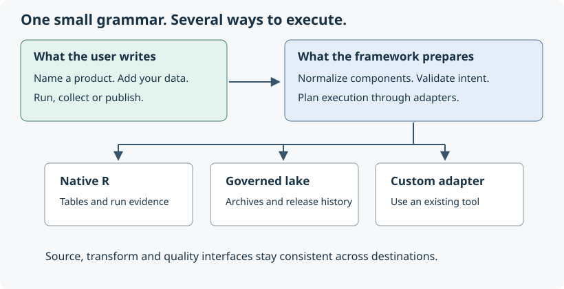

## Begin with what the user wants

A user wants a named, usable table. Its inputs, preparation, checks and destination
fit in one product definition. There is no required platform object and no
separate product type for derived data.

```{r definition}
library(tidyweave)
orders <- product("orders", data.frame(id = 1:2, amount = c(10, 20))) |>
  dplyr::mutate(amount = amount * 2) |>
  add_quality(~ amount >= 0)
orders
explain(orders)
```

Definition is separate from execution. Ordinary values are normalized at the
composition boundary: a path becomes a file source; a formula becomes a rule;
an R transform remains a function. A specification is useful when it carries
configuration, ownership or reusable intent. It is unnecessary for every
trivial operation.



## Separate intent from implementation

| Intent | Simple representation | Interchangeable implementation |
|---|---|---|
| Acquire data | Table, function or path | DBI, Arrow/Parquet, httr2 API, pins, custom source |
| Prepare a table | Deferred dplyr call or R function | Actual dplyr/dbplyr operations, SQL or dbt adapter |
| Enrich a primary table | `add_lookup()` with explicit equality keys | Native or dm checks; same guaranteed many-to-one join |
| Define expectations | Type vector or contract | Native schema and key checks |
| Check business rules | Formula or function | Native counts, pointblank or custom quality engine |
| Write the result | Target | Lake, DBI table, Parquet file, pin or custom writer |
| Deliver metadata | Optional catalog | Callback, OpenLineage or OpenMetadata |

Backend-specific arguments live in adapter constructors. A different destination
can keep the same source, transformation and rule composition. It can still have
different limits: a Parquet file does not become a lake release merely because
both implement `write_target()`.

## Choose execution defaults once

```{r execution-defaults}
execution <- execution_config(quality = "native", relationships = "native")
result <- orders |> run(execution = execution)
collect(result)
```

A definition describes the requested work; an explicit execution value supplies
optional engine and destination defaults. A step's explicit engine wins over the
default. Engine defaults travel through nested products and lookup dependencies.
Destination and layer defaults apply only to the root product. Dependencies with
no target remain in memory; their configured targets and layers remain unchanged. `ingest()` always accepts into RAW and rejects
conflicting publication-layer defaults. There is no ambient global context.

Specialist Pointblank agents and arbitrary quality functions keep their own
behavior. Choosing an engine for simple rules does not translate unsupported
specialist checks. `execution_config(quality = "pointblank", relationships = "dm")`
uses the optional engines with the same predicates and keys. Quality engine
selection participates in a stored contract's fingerprint. Changing engines for
an already registered explicit contract can require a new contract version;
the registered immutable version is not silently replaced.

## Reuse expectations without inventing meaning

```{r contract-composition}
order_contract <- contract("orders.schema", columns = c(id = "integer", amount = "numeric"),
  key = "id", grain = "One order")
enriched_contract <- contract_update(order_contract, id = "orders.enriched.schema",
  columns = c(channel = "character"), required = c(order_contract$required, "channel"))
```

`contract_update()` retains the original definition and derives an explicitly
identified successor. New columns are optional unless included in `required`.
The key remains meaningful here because adding an attribute preserves one order
per row. Changing grain requires an explicit key decision. Removing or changing
columns with existing rules requires explicit rule review. Arbitrary dplyr
transformations do not receive invented metadata or automatic key guarantees.
Simple formulas in contracts and `add_quality()` use the same normalization.

## Correct an input without reconstructing the workflow

```{r corrections}
corrected_orders <- orders |>
  replace_sources(source_1 = data.frame(id = 1:2, amount = c(10, 25)))
corrected_orders |> run() |> collect()
```

For a root product, replacements use named source aliases; a nested product may
be selected by its ID. Every matching graph reference is updated while shared
relationships are retained. Unknown and ambiguous names fail early. A managed
dbt project uses its logical source names. Replacing a definition does not rerun
it, update an already published release or silently unpin a previous result.

## The internal layers have small responsibilities

1. **Normalization** accepts convenient R inputs and gives them a consistent role.
2. **Composition** records named sources, ordered transforms and optional checks,
   one target and metadata destinations in a product.
3. **Preflight** checks the graph, dependencies and adapter configuration without
   running source callbacks. It cannot verify every remote permission or query.
4. **Execution** resolves dependencies, reads inputs, prepares the candidate,
   checks it and invokes the chosen target.
5. **Evidence** describes the outcome. Catalog delivery is a separate operation.

The lake adapter owns archival, full-candidate gates, release history and its
publication transaction. Internal storage helpers support that job; they are
not another public workflow language. `run()` is the common execution verb.
`publish()` shares the approval intention across products and successful dbt
builds. It supplies a local lake target for a product when absent. Receipt
validation uses data-first `ingest()` before any RAW table is written.

## Familiar syntax, deferred execution

The supported dplyr verbs are methods on the same product, not replacement
implementations of dplyr. Expressions and their environments are captured during
definition and invoked against the runtime table in step order. Inspection never
evaluates them. Unsupported verbs use `add_transform(function(data) ...)`.

Lookup references are auxiliary dependencies. They are validated, memoized and
recorded as lineage while the primary transform input remains one table.
Successful lake results normalize to immutable release references. Other results
reuse their retained submitted table or lazy query, preserving backend-specific
mutability. DBI append results reuse the submitted batch, not a snapshot of the
whole destination. Native and Pointblank logical rules share a predicate; native and dm lookups share cardinality and orphan policy.
Managed dbt projects derive connection profiles and accepted source bindings at
execution, while ordinary SQL models and dbt tests remain outside the R grammar.

## Lifecycle and results

```{r result}
result <- run(orders)
status(result)
lineage(result)
quality(result)
collect(result)
```

The definition remains a definition. The separate run result records lifecycle
states, timestamps, inputs, outputs, quality, status and available schema/row
metadata. A run can complete in memory, publish, reuse a cached release, be
blocked by quality, or fail during execution. Printing and accessors show the
useful summary; raw conditions remain available locally for debugging.
`status()` retains the native `status` and adds the common `outcome` categories
`succeeded`, `blocked`, `failed` and `skipped`. `lineage(result)` reads recorded
execution inputs, including pinned release identities when present; it does not
resolve the definition against today's current data.

Metadata is inferred from execution where possible. Manual metadata is mainly
business meaning: ownership, descriptions, declared keys and expectations.
Input fingerprints mean different things on different sources: a lazy query
fingerprint describes the query and is not proof that remote rows are unchanged.

`run(product, evidence = "runs")` adds durable local JSON evidence and a catalog
outbox. It excludes input rows, executable definitions, connection/request
objects and raw errors. Business descriptions and identifiers remain visible.
The lake registry stores storage/release history; an external business catalog
consumes metadata. These are separate responsibilities.

## Resource ownership

| Resource | Who closes it? | What the user must remember |
|---|---|---|
| Caller-supplied DBI connection | Caller | Keep it open while using lazy results |
| DBI source connection factory | tidyweave | Factory sources materialize before closing; lazy output is rejected |
| Caller-supplied lake | Caller | Close with `close_lake()` when finished |
| Folder/config opened by a lake target | tidyweave | The result keeps a durable release reference |
| Configuration/folder passed to report issuance or reading | tidyweave | Issuance writes explicitly; reading is read-only |
| dbt subprocess connections | dbt | Close conflicting local database connections before invocation |
| HTTP authentication | httr2 or your request factory | Supply fresh runtime credentials; do not store them in definitions |

Lazy execution keeps supported computation in DBI/Arrow. R-only algorithms and
certain targets need collection; use `collect()` deliberately. The lake target
archives materialized inputs. A multi-source join across different backends also
needs an explicit movement strategy; the framework does not silently invent one.

## Measure in batches, issue explicitly

`measure(approved, metrics = metrics, at = dates, period = "each")` computes the
metric-by-date combinations and keeps their original manifests in one measurement
set. `collect()` exposes a long tibble with dimensions, `.metric`, `.period`,
`.unit` and `value`. The list-valued `.period` preserves dates, including an
explicit multi-date selection for `period = "aggregate"`. Aggregate mode still
rejects a multi-date stock metric; convenience does not change time semantics.

`report_release(config, id, measurements, code_version = ...)` issues the original
measurement set. Its values and labels are integrity-checked, and its exact input
releases remain evidence. An ordinary collected table does not carry enough
information to issue that report. `report_read(config, id, values_only = TRUE)`
returns the saved batch as tidy values without recalculation. See the
[insurance example](relational-insurance.html) for correction and preservation
assertions across two monthly periods.

## Guarantees stay with their owner

Quality gates precede writes. Target adapters declare their storage guarantees
through `capabilities()` and implement their own atomicity and cleanup. DBI
transaction behavior depends on the driver. Local evidence requires one
coordinated writer. No multi-system transaction connects a data target to a
remote metadata service.

A catalog failure leaves an already published output published. Durable pending
deliveries can be retried with fresh adapters. Delivery is at least once, so
remote consumers should deduplicate stable run/event identities. OpenLineage
START and terminal events are buffered until execution finishes; this provides
historical lineage, not live monitoring.

Use targets for dependency caching and scheduling within its own model. Use an
external scheduler, CI or Connect for recurring execution. Keep definitions in
version control and use renv where dependency reproducibility matters. Inspection
JSON is descriptive; it cannot reconstruct closure environments or credentials.

## Why this architecture

The external design follows tidyverse habits: object-first verbs, pipes, ordinary
R objects and progressive configuration. Its internal structure draws on the
useful parts of tidymodels: explicit intent, modular specifications, composition,
validation and interchangeable implementations. There are no modeling APIs to
learn and no reason to turn every function into a specification.

This division makes the first example small while giving extension authors real
interfaces. The same product remains useful as its source, checks and destination
change. S3 and small capability declarations are sufficient; a plugin registry,
large mutable platform object and separate package family would add concepts
before they solve a current problem.

See [the extension guide](extending-tidyweave.html), the
[critical review](https://github.com/JanWein/tidyweave/blob/main/docs/REFACTOR_REVIEW.md)
and the [modern data stack comparison](https://github.com/JanWein/tidyweave/blob/main/docs/MODERN_DATA_STACK.md).
